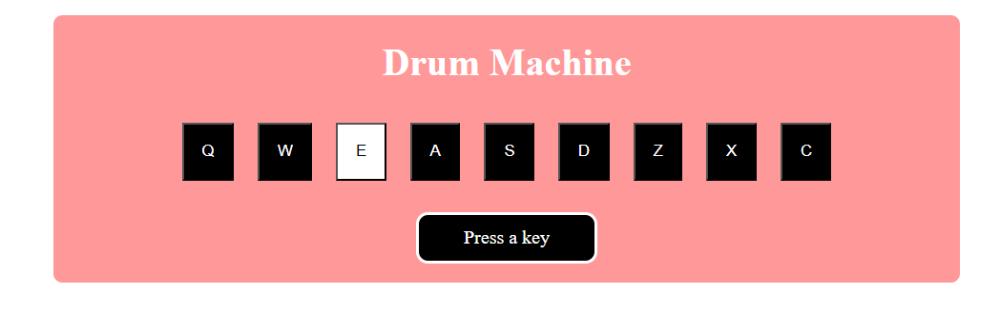

# Drum Machine

Drum Machine created with JavaScript. 
 
 
The app consists of 9 clickable drum pad elements, each with a unique audio clip that triggers when the user press the trigger key associated with it. Also a string describing the associated audio clip is displayed as the inner text when an audio is triggered.
 
 

| [:camera: Screenshots](#screenshots) | [🔖 License](#license) |
|  -------- | ----------- |

 

## Screenshots

## License

This project is licensed under the [MIT License](LICENSE.txt).
