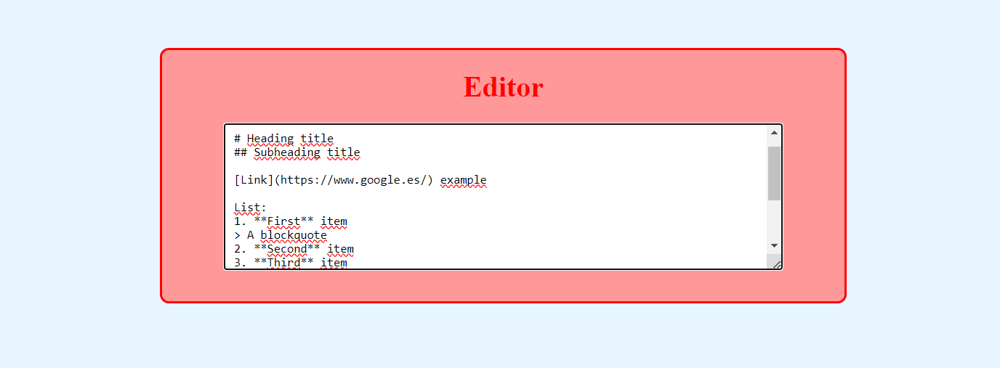
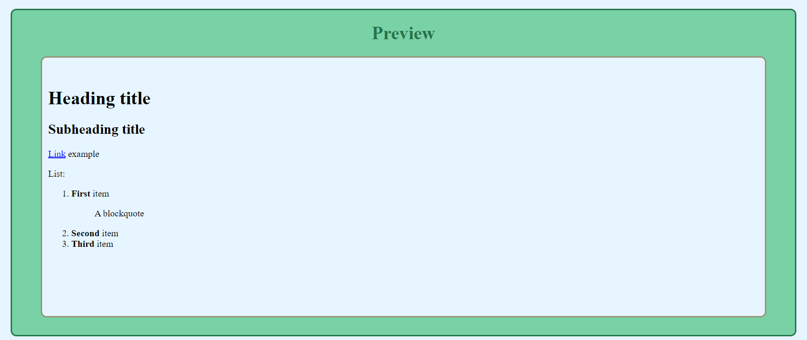

# Markdown Previewer

Markdown Previewer created with JavaScript. 
 
 
When the user enters GitHub flavored markdown into the editor element, the text is rendered as HTML in the preview element as the user types. It serves as a practical way to learn about Markdown syntax.
 
 

| [:camera: Screenshots](#screenshots) | [🔖 License](#license) |
|  -------- | ----------- |

 

## Screenshots

## License

This project is licensed under the [MIT License](LICENSE.txt).
