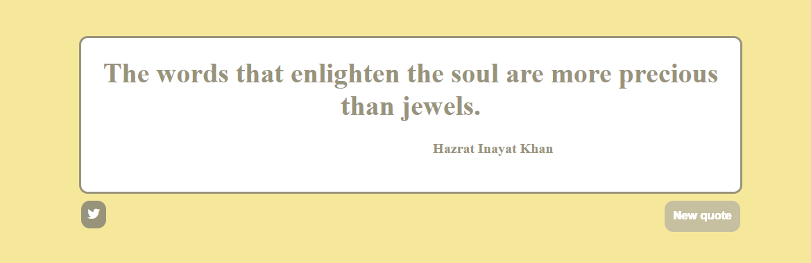

# Random Quote Machine

Random Quote Machine created with Javascript.
 
 
On first load, the quote machine displays a random quote and its author. When the button is clicked, the quote machine fetchs a new quote and displays it. 
This app serves as a simple example of fetching random items stored in an array thanks to the generation of an also random index.
 
 

| [:camera: Screenshots](#screenshots) | [🔖 License](#license) |
|  -------- | ----------- |

 

## Screenshots

## License

This project is licensed under the [MIT License](LICENSE.txt).
